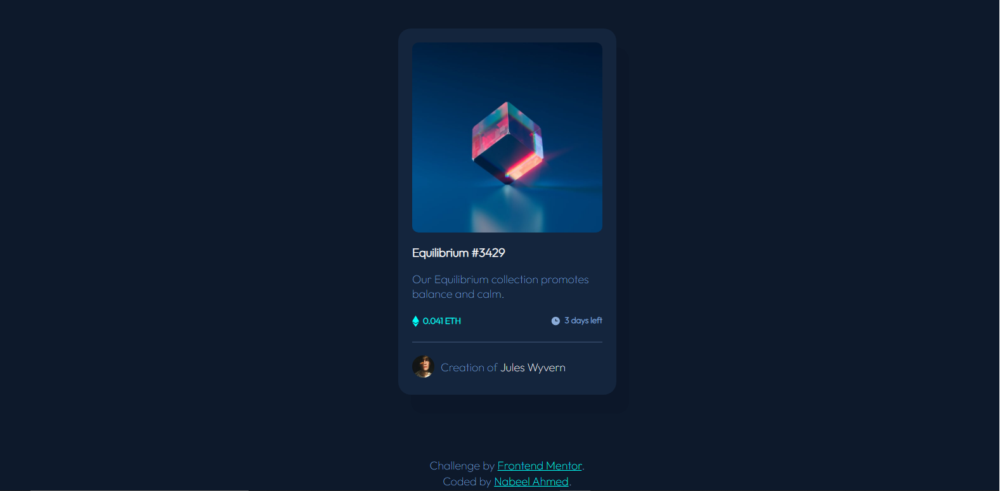

# Frontend Mentor - NFT preview card component solution

This is a solution to the [NFT preview card component challenge on Frontend Mentor](https://www.frontendmentor.io/challenges/nft-preview-card-component-SbdUL_w0U). Frontend Mentor challenges help you improve your coding skills by building realistic projects. 

## Table of contents

- [Overview](#overview)
  - [The challenge](#the-challenge)
  - [Screenshot](#screenshot)
  - [Links](#links)
- [My process](#my-process)
  - [Built with](#built-with)
  - [What I learned](#what-i-learned)
  - [Useful resources](#useful-resources)
- [Author](#author)

## Overview

### The challenge

Users should be able to:

- View the optimal layout depending on their device's screen size
- See hover states for interactive elements

### Screenshot

### Links

- Solution URL: [Add solution URL here](https://your-solution-url.com)
- Live Site URL: [Add live site URL here](https://your-live-site-url.com)

## My process

### Built with

- Semantic HTML5 markup
- CSS custom properties
- Flexbox
- JavaScript

### What I learned

I learned the concepts of CSS flexbox and also how to access and update DOM elements using JavaScript 

### Useful resources

- [CSS tutorial on W3Schools](https://www.w3schools.com/css/default.asp) - This helped me for learning CSS flexbox.
- [JS tutorial on W3Schools](https://www.w3schools.com/js/default.asp) - This JavaScript tutorial helped me to understand accessing DOM elements using JavaScript

## Author

- Frontend Mentor - [@Nabeel529886](https://www.frontendmentor.io/profile/Nabeel529886)
- Twitter - [@codingnabbo](https://www.twitter.com/codingnabbo)

